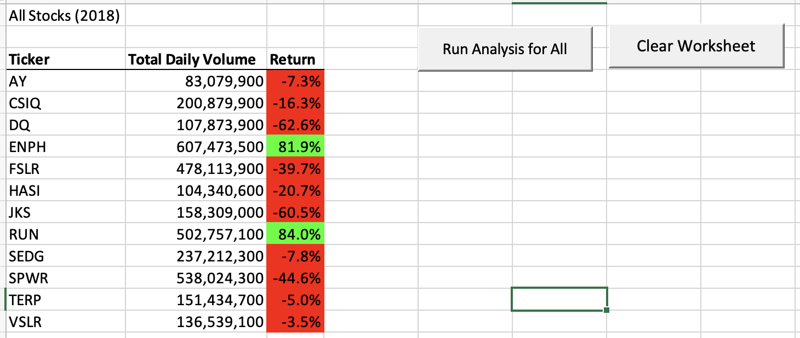
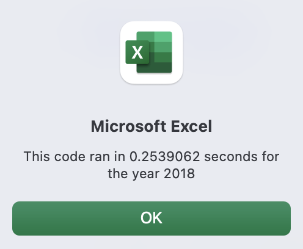
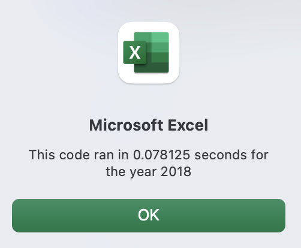

# Stock-Analysis With VBA

## Overview of the Project 

### Purpose and Background

***Background***

Steve wants us to analyze twelve different green energy stocks to see if they are worth investing in. He wants to be able to easily analyze an entire dataset of stocks in both years 2017 and 2018. The key information he wants summarized for each type of stock is the Total Daily Volume and Return. 

Instead of manually using formulas in excel each time there is new data added, we wrote different VBA Scripts for Excel to do the work for us! Since he doesn't know how to use VBA in Excel, it was our job to create a VBA script to make the analysis happen at the click of a button. 

***Purpose***

The purpose of this new VBA script is to refactor the code to make it run more efficiently (faster) to output each Ticker's name, Total Daily Volume, and Return. Instead of having the code run through the sheet multiple times for each ticker, the refactored code should enable the code to go through our data much quicker (by eliminating our nested for loop). See the screenshot below for the Analysis for All Stocks in 2018.




## Results 
In order to refactor the code that was already written, I needed to create separate for loops instead of a nested loop to run through the data one time to collect all the needed information. To do this, I needed to first create a ticker Index, three different output arrays (for Volumes, Starting and Ending Prices), and set tickerVolumes to zero. 

```
    
    '1a) Create a ticker Index
    Dim tickerIndex As Single
        
        'Set equal to zero
        tickerIndex = 0

    '1b) Create three output arrays
    Dim tickerVolumes(12) As Long
    Dim tickerStartingPrices(12) As Single
    Dim tickerEndingPrices(12) As Single
    
    
    ''2a) Create a for loop to initialize the tickerVolumes to zero.
    For i = 0 To 11
    
        tickerVolumes(i) = 0
        
    Next i
```

Next, I created another for loop without nesting to find and store the information for our three arrays. To do this, I made sure to use tickerIndex as our variable. From these new set values, I found the array values similarly to how we did before.  At the end of this loop, we had to increase the tickerIndex by 1 to start the loop for the next ticker. In the third for loop, to get our output values in our table in our new sheet, we first needed to activate our "All Stocks Analysis" worksheet. Then we ran a for loop to create values for each of the cells in our table. See the VBA code below. 

```
    '2b) Loop over all the rows in the spreadsheet.
    For i = 2 To RowCount
    
        '3a) Increase volume for current ticker
        tickerVolumes(tickerIndex) = tickerVolumes(tickerIndex) + Cells(i, 8).Value
        
        '3b) Check if the current row is the first row with the selected tickerIndex.
        'If Then
        If Cells(i - 1, 1).Value <> tickers(tickerIndex) And Cells(i, 1).Value = tickers(tickerIndex) Then
            
            tickerStartingPrices(tickerIndex) = Cells(i, 6).Value
            
        End If
        
        '3c) check if the current row is the last row with the selected ticker
         'If the next row’s ticker doesn’t match, increase the tickerIndex.
        'If  Then
        If Cells(i + 1, 1).Value <> tickers(tickerIndex) And Cells(i, 1).Value = tickers(tickerIndex) Then
            
            tickerEndingPrices(tickerIndex) = Cells(i, 6).Value
            
            

            '3d Increase the tickerIndex.
            tickerIndex = tickerIndex + 1
            
        End If
    
    Next i
    
    '4) Loop through your arrays to output the Ticker, Total Daily Volume, and Return.
    For i = 0 To 11
        
        Worksheets("All Stocks Analysis").Activate
        
        Cells(4 + i, 1).Value = tickers(i)
        Cells(4 + i, 2).Value = tickerVolumes(i)
        Cells(4 + i, 3).Value = tickerEndingPrices(i) / tickerStartingPrices(i) - 1
        
    Next i
    ```
    
    Lastly, the formatting stayed the same. 
  
  ```
      'Formatting
    Worksheets("All Stocks Analysis").Activate
    Range("A3:C3").Font.FontStyle = "Bold"
    Range("A3:C3").Borders(xlEdgeBottom).LineStyle = xlContinuous
    Range("B4:B15").NumberFormat = "#,##0"
    Range("C4:C15").NumberFormat = "0.0%"
    Columns("B").AutoFit

    dataRowStart = 4
    dataRowEnd = 15

    For i = dataRowStart To dataRowEnd
        
        If Cells(i, 3) > 0 Then
            
            Cells(i, 3).Interior.Color = vbGreen
            
        Else
        
            Cells(i, 3).Interior.Color = vbRed
            
        End If
        
    Next i
    ```

To see whether refactoring made a difference on the time it took to run the analysis, I first ran the analysis for our first VBA script for the year 2018 using the timer function. It took approximately 0.254 seconds. 



After refactoring the code, I ran the timer for the new VBA script. It took 0.078 seconds! It was about 0.176 seconds faster. 




## Summary 
***Advantages and Disadvantages of Refactoring Code***

Refactoring code has both advantages and disadvantages. By refactoring general code, we are telling the computer to take fewer steps. This allows the code to use less memory, run faster, and is more organized.  Refactored code is also easier to understand by someone else who is reading our code/ scripts. In the real world, some disadvantages of refactoring code might be that a company does not have the time, employers, or money to do so. 

***Pros and Cons of Refactoring VBA Code***

Like general coding, there are pros and cons of refactoring code in VBA. For me, it was really difficult to refactor our already working code. Before receiving tutoring, I had a difficult time trying to understand why we needed more for loops. Then I understood a little more about arrays and indexes. With alot of trial and error, I found that some of my code did not work properly during the process of refactoring. However, after finally refactoring the code, the data analysis of the stocks did run faster! In hindsight, I am now able to understand why more for loops created a more organized and clearer way for us to retrieve our data in less steps! Lastly, the new refactored code looks more clean and organized for future readers to understand better. 
